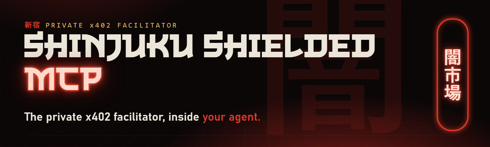

<p align="center"></p>

<p align="center">


</p>

# Shinjuku Shielded MCP

The private x402 facilitator, inside your agent.

Shinjuku Shielded settles x402 payments from a shielded USDC balance on
Solana: on chain, a shielded payment does not show who paid. This MCP server
is how your agent uses it. It runs on your machine, under caps that only you
set.

- **Self-custody.** The server runs on your machine. Your keys never leave
  it. We never run it, and we never hold your money.
- **Shielded payments.** Your agent pays from a shielded balance. Add `--tor`
  and no server sees your IP.
- **One command to set up.** `npx -y shinjuku-shielded mcp` offers the
  setup on a machine with no wallet. It makes the wallet, a private
  passphrase file, and the checked proof tools.
- **Caps that only you set.** Setup records them (default: 0.05 USDC per
  payment, 1 USDC per session). A tool call can only lower them, never raise
  them.
- **Find sellers.** `x402_discover` searches public x402 listings
  (Coinbase x402 Bazaar, PayAI, Dexter, and others) on your machine.
- **Look before you pay.** `x402_preview` shows the price and whether your
  caps allow it. It pays nothing.
- **No SOL.** `wallet_shield` needs only USDC. Our facilitator's relayer
  pays the network fee.
- **Never twice.** A retry with the same `request_id` resumes the same
  payment, deposit, or unshield. It never starts a second one.
- **No RPC, no account, no API key.** Reads go through our relay by default.
  Your own RPC always wins if you give one.

Every Shinjuku Shielded service joins this MCP as it ships.

The server is the `mcp` command of `shinjuku-wallet`, one file. This
repository holds the setup guide and [examples](examples/). The wallet file, its SHA-256, and its
release history are in
[ShinjukuStaition/shinjuku-shielded](https://github.com/ShinjukuStaition/shinjuku-shielded).

## Talk to it in plain words

Ask your agent the way you would ask a person:

| You say | Your agent calls |
|---|---|
| "what is my balance" | `wallet_balance` |
| "shield 5 USDC" | `wallet_shield` |
| "find a seller of satellite images" | `x402_discover` |
| "pay this URL" | `x402_preview`, then `x402_pay` |
| "send 2 USDC privately to <address>" | `wallet_unshield` |

Each answer tells the agent the exact next call. The wallet reads the chain
and writes an encrypted backup by itself, so you never run a command for
upkeep.

## Tools

### SETUP

On a machine with no wallet, the server starts in setup mode.

| Tool | What it does |
|---|---|
| `shinjuku_setup` | Asks you to confirm in your MCP client that it may create a Shinjuku Shielded wallet on this machine, and shows the caps. Then it runs the setup and switches the same server to the wallet tools. It never asks for a secret. A client that cannot ask is told to run `npx -y shinjuku-shielded setup` in a terminal. |
| `wallet_status` | Says whether the wallet is set up, and what to do next. |

In setup mode, every money tool answers `wallet_not_set_up` and does
nothing.

### SHIELD

| Tool | What it does |
|---|---|
| `wallet_shield` | Moves USDC from the wallet's own Solana key into your shielded balance. It is on with `--proof-tools`. `--no-shield` turns it off. Funding takes minutes: the first call starts it and returns a stage. Call again with the same `request_id` to see the stage. It never starts a second deposit. When the deposit lands, the wallet reads it from the chain and writes an encrypted backup. The wallet's own key needs the USDC and no SOL: our facilitator's relayer pays the network fee, and you pay the shield cost. |

### PAY

| Tool | What it does |
|---|---|
| `x402_discover` | Searches public x402 listings (Coinbase x402 Bazaar, PayAI, Dexter, and others) on your machine and returns the sellers that match. Pays nothing. The first call takes about 15 s. |
| `x402_preview` | One unpaid request. Returns the seller's price, the scheme, and whether your caps allow it. Pays nothing. A seller that lists several networks is priced from its Solana offer. |
| `x402_pay` | Pays the URL (if it asks for payment) and returns the answer. A URL that does not answer 402 is fetched once and nothing is paid. An image answer (image bytes, or JSON `image_base64`) comes back as an MCP image block, and the file is saved. A payment that landed, from a seller that gives no answer, closes as paid. Alias: `fetch_paid`. |

### UNSHIELD

| Tool | What it does |
|---|---|
| `wallet_unshield` | Sends shielded USDC to a public Solana address. It is on with `--exit-proof-tools` and `--profile`. Our facilitator pays every network fee. The same `request_id` never unshields twice. An address that you named with `--unshield-to` is sent at once. Any other address is sent only after you confirm it in your MCP client: "Send X USDC from your shielded balance to <address>?". A decline, or no answer in 5 minutes, sends nothing. A client that cannot ask is refused, so a prompt injection cannot pick an address by itself. The wallet's own key is refused: it made the deposits, so an exit there would link them. |

### ACCOUNT

| Tool | What it does |
|---|---|
| `wallet_balance` | SHIELDED (what your agent can pay with) and UNSHIELDED (plain USDC on the wallet's own Solana key), each on its own line, plus pockets, unfinished payments, and what this session may still pay. A stale balance is read from the chain first. UNSHIELDED is one network read; if it fails, that line is empty and says why. |
| `wallet_receipts` | Your most recent paid receipts: host (never the full URL), amount, transaction, time. |

Also: `wallet_cancel` closes one unfinished payment, so its reserved balance
comes back.

`wallet_shield` and `wallet_unshield` always appear in the tool list. When
one is off, it answers `"error": "mcp_tool_disabled"` and tells the agent
what to ask you.

What it pays: x402 scheme `shielded-exact` from your shielded balance, and
standard Solana `exact` from a ready pocket. A ready pocket pays any Solana
x402 `exact` seller, whichever facilitator settles it. Pockets are automatic:
when a standard `exact` seller needs one, `x402_pay` fills a 1 USDC pocket
from your shielded balance. `--ready-pockets` sets how many stay ready, and
`--no-auto-pockets` turns this off. A seller receipt that names another
payer is checked on chain. For sellers that
offer only `confidential` (hidden amounts), use `shinjuku-wallet laneb pay-url`.

## Privacy modes

| | Default | `--tor` |
|---|---|---|
| On chain | A shielded payment does not show who paid. | The same. |
| Your IP | Payments go to `pay.shinjukustaition.com`, with no CDN in the path. Our server sees your IP. It keeps no access logs. | Hidden from everyone, us included. |
| The seller | Sees your IP. | Does not see your IP. |
| Speed | Faster. | About 1-2 s slower per request. |
| Needs | Nothing extra. | Tor with `HTTPTunnelPort 127.0.0.1:9080 IsolateDestAddr` in `torrc`. |

## Setup

You need Node.js 22 or later, on Linux, or on Windows with WSL. macOS is not
supported: the provers are Linux programs. The current wallet release is
`14dd9efa` (npm `shinjuku-shielded@0.3.4`).

Update from an earlier version. The pool program was upgraded on 2026-10-08
and again on 2026-10-09. Earlier versions pin the program from before the
upgrade, so they now refuse payments. Run `npx -y shinjuku-shielded@latest setup`
once: it keeps your wallet and pins the new program.

### 1. Add the server to your agent

Claude Code:

```sh
claude mcp add --scope user shinjuku-shielded -- npx -y shinjuku-shielded mcp
```

Claude Desktop (`claude_desktop_config.json`), Cursor (`~/.cursor/mcp.json`),
and other JSON-config hosts:

```json
{
  "mcpServers": {
    "shinjuku-shielded": {
      "command": "npx",
      "args": ["-y", "shinjuku-shielded", "mcp"]
    }
  }
}
```

### 2. Start it and accept the setup

The first time, the server has no wallet, so it starts in setup mode. Ask
your agent "what is my balance". Your MCP client asks you to confirm: create
a Shinjuku Shielded wallet on this machine. Accept, and the setup runs (about
25 s in our test, with the proof-tool download of about 150 MB). Then the
same server switches to the wallet tools. You do not restart it.

In a terminal, `npx -y shinjuku-shielded mcp` asks
"Set up Shinjuku Shielded now? (y/n)". Or run the setup by itself:

```sh
npx -y shinjuku-shielded setup
```

It asks for the caps (Enter keeps the default) and Tor. `--yes` asks
nothing. `--add-to claude-code` (or `claude-desktop`, `cursor`) also adds
the server to that host's config.

Setup writes to `~/.carbon-shielded-wallet` (or `SHIELDED_WALLET_HOME`):

- The wallet, and a recovery file with the seed and the key. Copy the
  recovery file to two offline places, then delete it from this machine.
- `passphrase.txt`: a new random passphrase, readable by you alone. It is
  never printed, and no tool takes or returns it.
- The proof tools. Setup checks every file against the set that this wallet
  release pins.
- `config.json`: the caps, the paths, and Tor. With it, `mcp` needs no
  flags. A flag on the command line still wins.

Default caps: 0.05 USDC per payment, 1 USDC per session, and 20 USDC for the
life of the wallet (`--max-payment`, `--max-session`, `--max-total`, in
atomic USDC: `50000` = 0.05 USDC). `--prefer-tor` records Tor (see Privacy
modes).

You can run `setup` again at any time. It never changes an existing wallet,
and it checks every proof-tool file again.

### 3. Fund it

Ask your agent "what is my wallet address?". Send USDC (Solana SPL) to that
address. You do not need SOL. Then say "shield 1 USDC". The steps are in
[First 10 minutes](examples/README.md#first-10-minutes).

### Advanced: download the file and check it

Download the release file and check its SHA-256 before you run it. The
current file and hash are also in the
[Releases table](https://github.com/ShinjukuStaition/shinjuku-shielded#releases)
and in section 7b of https://shinjukustaition.com/skill.md.

```sh
curl -fsSLO https://shinjukustaition.com/wallet/14dd9efa/shinjuku-wallet.mjs
echo "14dd9efa7c6bbd2906a56e732a4aff9d23c7b867b6fd9fec4f005494acc3823b  shinjuku-wallet.mjs" | sha256sum -c -
node shinjuku-wallet.mjs setup
```

With the file, replace `npx -y shinjuku-shielded` with
`node /abs/path/shinjuku-wallet.mjs`. To pin the npm version, write
`shinjuku-shielded@0.3.4`.

### Advanced: flags instead of config.json

`mcp` reads `config.json` only when you give no `--pool` and no `--wallet`.
To set every flag yourself (for example, for a wallet that you made with
`init` before 0.2.0):

```sh
claude mcp add --scope user shinjuku-shielded -- npx -y shinjuku-shielded mcp \
  --max-payment 50000 --max-session 200000 --tor \
  --pool AAG16mNWTtC1sBeu2tTVTwWjqWXCefLTCByVPj5X3kV8 \
  --program 8PYPw3FSFTMbvSneXdcoH6jNoN4VD23nHwPY2A2riUy1 \
  --memo-service https://pay.shinjukustaition.com \
  --proof-tools /abs/path/shinjuku-proof-tools/proof-tools.json \
  --exit-proof-tools /abs/path/shinjuku-proof-tools/exit-proof-tools.json \
  --profile /abs/path/shinjuku-proof-tools/public-profile.json \
  --passphrase-file /abs/path/passphrase.txt
```

Use absolute paths: a host starts the server from its own folder. On Windows,
write `C:/Users/you/...`. `--proof-tools` turns `wallet_shield` on.
`--exit-proof-tools` and `--profile` turn `wallet_unshield` on.

For an older wallet, you can also run `setup` once with
`SHIELDED_WALLET_HOME` set to your wallet folder and `--passphrase-file`
set to your passphrase file. It keeps your wallet and writes `config.json`
beside it.

A send to a new address needs a host that supports MCP elicitation (it shows
you the confirmation). With a host that does not, name each address with
`--unshield-to`.

## Examples

[examples/](examples/) has complete configs and a walkthrough:

- [Claude Code](examples/claude-code.md): the `claude mcp add` command, the
  first start, Tor, each flag explained, and how to check it works.
- [Claude Desktop](examples/claude-desktop.json) and
  [Cursor](examples/cursor.json): complete JSON configs.
- [Hermes Agent](examples/hermes.md): the `config.yaml` entry.
- [First 10 minutes](examples/README.md#first-10-minutes): add the server,
  set it up, fund it, shield, pay, send, and check the balance.
- [Plain requests](examples/prompts.md): 11 requests, the tool each one
  calls, and the shape of the answer.

## Caps and flags

After setup, `config.json` holds the caps and the paths. You can add any of
these flags to the `mcp` command. A flag wins over `config.json`.

| Flag | |
|---|---|
| `--max-payment <atomic>` | The most one payment may cost. Setup records it. With no `config.json` and no flag, the server does not start (`mcp_cap_required`). |
| `--max-session <atomic>` | The most this server process may pay in total. Must be at least `--max-payment`. Setup records it. |
| `--max-per-host-day <atomic>` | Optional. The most one seller host may receive in 24 hours. |
| `--allow-host <host>` | Optional, repeatable. Pay only these seller hosts. |
| `--no-shield` | Optional. Turns `wallet_shield` off. It is on with `--proof-tools`. |
| `--max-shield <atomic>` | Optional. The most one shield call may move, and the most this process may shield in total. Without it, no cap beyond the balance. |
| `--allow-shield` | Accepted for older configs. `wallet_shield` is on without it. |
| `--exit-proof-tools <file>`, `--profile <file>` | Optional. Turn `wallet_unshield` on (with `--proof-tools`). |
| `--unshield-to <address>` | Optional, repeatable. These addresses receive with no confirmation. Any other address needs your confirmation in the MCP client. The wallet's own key is refused: the server does not start when you name it here. |
| `--ready-pockets <0-5>` | Optional. How many 1 USDC pockets stay ready for standard `exact` sellers. Default 1. |
| `--no-auto-pockets` | Optional. `x402_pay` does not fill a pocket by itself. |
| `--max-unshield <atomic>` | Optional. The most one unshield call may move, and the most this process may unshield in total. Without it, a send you confirm can move the whole shielded balance. |
| `--no-tor` | Optional. This run does not use the Tor that setup recorded. |
| `--tor` | Optional. Every request goes through Tor; our facilitator is reached over its onion service. Needs Tor with `HTTPTunnelPort 127.0.0.1:9080` in `torrc`. See Privacy modes. |
| `--rpc-file <file>` | Optional. Your own Solana RPC URL. Without it, reads go to our relay, which sees which accounts the wallet reads. |

The passphrase comes from `--passphrase-file` or `SHIELDED_WALLET_PASSPHRASE`
at start, never from a tool call. A refusal is a normal answer
(`{"ok": false, "error", "detail", "next"}`); the agent does what `next`
says. A cap refusal tells the agent to ask you: only you set the caps.

An unshield is your own money, so it does not count against the payment
budget of the wallet file (`init --max-payment`, `--max-cumulative`).
Payments to sellers still count.

Upkeep is automatic. After a deposit lands, and before a payment or unshield
when the local balance is stale, the server reads the chain itself. By
default it reads the pool history through our facilitator's https history
proxy: a new wallet is ready in about 60 s. After
each shield and unshield, the wallet writes an encrypted backup to
`<SHIELDED_WALLET_HOME>/auto-backups/<pool>/`. It keeps the newest 5
complete, verified backups. They are on the same disk as the wallet: copy
one to another place.

## What others can see

- The seller sees your request, the price, the time, and your IP unless you
  use `--tor`.
- Your agent host and its model provider see every URL, body, price, paid
  answer, amount, and unshield address the agent handles. A local model
  removes that observer.
- Your MCP client app (Claude Code, Claude Desktop, Cursor, ...) answers the
  confirmation of a send, not the model. So a prompt-injected agent cannot
  approve a send. But the wallet trusts the client app to show the dialog to
  you: a malicious or modified client app could answer "accept" by itself.
  For a strict setup, name your addresses with `--unshield-to` and use a
  client without elicitation. Then any other address is refused.
- Our facilitator processes your payment. It keeps no access logs.
- On chain, a `shielded-exact` payment does not show who paid. A pocket
  `exact` payment is a normal USDC transfer from the pocket address.
- `wallet_shield` is a public step: the chain shows USDC leave the wallet's
  own key, the amount, and the time.
- `wallet_unshield` is a public step: the chain shows the amount, the
  address that receives it, and the time.
- The UNSHIELDED line of `wallet_balance` reads the wallet's own key. The RPC
  (our relay by default) sees which key it reads.
- Privacy needs a crowd. With few users, timing can still link payments.

## Status

Listed in the official [MCP Registry](https://registry.modelcontextprotocol.io/v0/servers?search=io.github.ShinjukuStaition/shinjuku-mcp)
as `io.github.ShinjukuStaition/shinjuku-mcp`. npm: [`shinjuku-shielded`](https://www.npmjs.com/package/shinjuku-shielded),
published from this repository's workflow with npm provenance (from 0.1.1).

Live on Solana mainnet. The current wallet release is `14dd9efa` (npm
0.3.4). These transactions were made with real money through this MCP
server, against our production facilitator. The first two came from a new
wallet with the default setup and no SOL at any time (wallet release
`94a357bc`, an earlier release). The others used wallet release `1a336885` (2026-10-08).

| Tool | Transaction |
|---|---|
| `wallet_shield` (no SOL) | [`5np1EYjN…fH2`](https://solscan.io/tx/5np1EYjNkr5w7Tt6ng2KQ9cp7RgNkhpwAKtzkm2nyRKMgi1FsmM3TMZMx8EkyiAV4sUtoQ3mTtTbuehas1qV3fH2) |
| `x402_pay` to a public satellite-imagery seller (0.013 USDC, JPEG answer in 8 s) | [`iC6gnjFM…DHwC`](https://solscan.io/tx/iC6gnjFMBwHaqArgcRL6C5GdNbcWMom82cZqcQ2C2xup9aXJX91HXmWozQcVvAyTSTZsRptynfdbBPjjxG9DHwC) |
| `wallet_shield` (1 USDC in) | [`hWzDiR1R…izn`](https://solscan.io/tx/hWzDiR1RnC1gFXMMrCxRBCZ4R5dgMreWGX7vyQCTUTWkKaKnYvxmro6PQuE9KMYVbrq3NkNu9YaJzj7XaqrDizn) |
| `wallet_unshield` (0.5 USDC out) | self-pay [`5evVHz8X…r9uv`](https://solscan.io/tx/5evVHz8XvMdSYF76BQ1xv3TazwS9P38FEXp81gipNMMSqn61Rj7EUc1DdgpYz591wQbBZMWcpNVznixXPsfZr9uv) · exit [`4yY2YXLS…pgF2i`](https://solscan.io/tx/4yY2YXLSj1EyUWDb7X9985KmyeNGQieF8skg3uN3sv3Pds3zSb42J5owDWMUTshui6XACkP4zwGxUmXXTVapgF2i) |
| `wallet_unshield` with your confirmation (0.25 USDC, release `1a336885`) | self-pay [`3jQyPgrA…QEWw`](https://solscan.io/tx/3jQyPgrA5AtFcqzyWHDWRcfNv66sM5qfCStxsByYDqGm7W5uRWkUMHpLoFUFm2jc98Aor7CXSToAChSHD7dWQEWw) · exit [`4yA3qkHU…jCoh`](https://solscan.io/tx/4yA3qkHUto7e7iUGM9q6321avTm8aZQJ6zNMMh18SoAACnvgtvbWpVydry3mCq9iKaSZv92FfH43NJu557zjCoh) |
| `x402_pay` (pocket `exact`) | [`kX2zbbuR…8wW`](https://solscan.io/tx/kX2zbbuRbskBQ2EnazyDBu7oZ7BtySVT7zDmtBn7ZivMm3guhLWrJGiPFFLzTEyxwTKUkeSAJjTJLSWLHYP48wW) |

No unshield transaction contains the wallet that shielded; our facilitator
paid every network fee of each unshield.

Full guide: https://shinjukustaition.com/skill.md ·
Onion: http://2kfhlfuyuwvhmibjrpxqsg4nrbcxasjgjq7kmnfzgfwzptkhhznz3dad.onion/skill.md ·
X: [@Shin_StAItion](https://x.com/Shin_StAItion)
